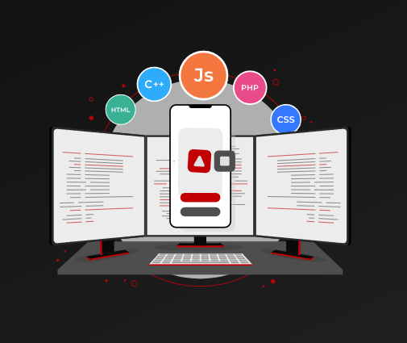

# Next.js Blog with MongoDB Integration

This is a [Next.js](https://nextjs.org) project bootstrapped with [`create-next-app`](https://github.com/vercel/next.js/tree/canary/packages/create-next-app).

## 🚀 Features

- ✅ **Full-Stack Blog System** with MongoDB database
- ✅ **Content Management** - Create, read, update, delete blog posts
- ✅ **Real-time Data** - Posts stored in MongoDB, not localStorage
- ✅ **Responsive Design** - Works on all devices
- ✅ **Dark Mode** - Toggle between light and dark themes
- ✅ **Search & Filter** - Find posts by category, tags, or content
- ✅ **Featured Posts** - Highlight important content
- ✅ **Tag System** - Organize content with tags
- ✅ **View Counter** - Track post engagement

## 🛠️ Tech Stack

- **Frontend**: Next.js 15, React, Tailwind CSS
- **Database**: MongoDB with Mongoose ODM
- **UI Components**: shadcn/ui, Lucide React icons
- **Styling**: Tailwind CSS with custom dark mode
- **Animation**: Lottie React for animations

## 📦 Installation

1. **Clone the repository:**
   ```bash
   git clone <your-repo-url>
   cd blog_code
   ```

2. **Install dependencies:**
   ```bash
   npm install mongodb mongoose
   ```

3. **Set up MongoDB:**
   ```bash
   # Option 1: Use local MongoDB (recommended for development)
   # Install MongoDB from https://www.mongodb.com/try/download/community
   
   # Option 2: Use MongoDB Atlas (cloud)
   # Create account at https://cloud.mongodb.com/
   ```

4. **Configure environment variables:**
   ```bash
   # Copy the example env file
   cp .env.local.example .env.local
   
   # Edit .env.local with your MongoDB connection string
   MONGODB_URI=mongodb://localhost:27017/nextjs-blog
   ```

5. **Seed the database (optional):**
   ```bash
   npm run seed
   ```

6. **Start the development server:**
   ```bash
   npm run dev
   ```

7. **Open your browser:**
   ```
   http://localhost:3001/
   ```
## 📁 File Structure Updates
```bash
blog_code/
├── app/
│   ├── api/
│   │   ├── upload/
│   │   │   └── route.js          # Image upload endpoint
│   │   └── posts/
│   │       ├── route.js          # Enhanced with GitHub support
│   │       └── [id]/route.js     # Updated CRUD operations
│   ├── content/
│   │   └── page.js               # Enhanced form with upload & GitHub
│   └── blog/
│       └── page.js               # Smart GitHub/article buttons
├── models/
│   └── BlogPost.js               # Added githubLink field
├── public/
│   └── uploads/                  # Image storage directory
└── lib/
    └── mongodb.js                # Database connection
```

## 🗄️ Database Schema

The application uses MongoDB with the following collection:

### BlogPost Collection
```javascript
BlogPost {
  _id: ObjectId,
  title: String (required, max 200),
  excerpt: String (required, max 500),
  content: String (required),
  author: String (required, max 100),
  category: String (enum values),
  tags: [String],
  image: String,                  // Now stores uploaded file path
  githubLink: String,             // New: GitHub repository URL
  readTime: String,
  featured: Boolean,
  views: Number,
  createdAt: Date,
  updatedAt: Date
}
```

## 🔗 API Endpoints

| Method | Endpoint | Description |
|--------|----------|-------------|
| GET | `/api/posts` | Get all posts (with filtering) |
| POST | `/api/posts` | Create new post |
| GET | `/api/posts/[id]` | Get single post |
| PUT | `/api/posts/[id]` | Update post |
| DELETE | `/api/posts/[id]` | Delete post |

### API Usage Examples

```javascript
// Get all posts
const response = await fetch('/api/posts')
const { data } = await response.json()

// Create a new post
const response = await fetch('/api/posts', {
  method: 'POST',
  headers: { 'Content-Type': 'application/json' },
  body: JSON.stringify({
    title: 'My Blog Post',
    excerpt: 'A short description',
    content: 'Full blog content...',
    author: 'John Doe',
    category: 'React',
    tags: ['React', 'JavaScript']
  })
})

// Filter posts by category
const response = await fetch('/api/posts?category=React')

// Search posts
const response = await fetch('/api/posts?search=mongodb')
```

## 🎨 Content Management

### Creating Blog Posts

1. Navigate to `/content`
2. Click "Create Blog Post" tab
3. Fill out the form:
   - **Title**: Post title (required)
   - **Author**: Your name (required)
   - **Category**: Select from available categories
   - **Excerpt**: Brief description (required)
   - **Content**: Full blog content (required)
   - **Tags**: Comma-separated tags
   - **Image**: Featured image URL
   - **Read Time**: Estimated reading time
   - **Featured**: Mark as featured post

### Managing Posts

1. Navigate to `/content`
2. Click "Manage Posts" tab
3. View all your posts
4. Search posts by title, content, or tags
5. Delete posts with confirmation

## Getting Started

First, run the development server:

```bash
npm run dev

```

Open [http://localhost:3000](http://localhost:3000) with your browser to see the result.

You can start editing the page by modifying `app/page.js`. The page auto-updates as you edit the file.

This project uses [`next/font`](https://nextjs.org/docs/app/building-your-application/optimizing/fonts) to automatically optimize and load [Geist](https://vercel.com/font), a new font family for Vercel.

##  Components

- [shadcn/ui](https://ui.shadcn.com/) - Beautiful UI components built with Radix UI and **Tailwind CSS**
    - `npx shadcn@latest init` → <span style="color: #22c55e; font-weight: bold;">✅ Installed</span>
    - `npx shadcn@latest add button` → <span style="color: #3b82f6; font-weight: bold;">📦 Added</span>
    - `npm install next-themes` → <span style="color: #3b82f6; font-weight: bold;">📦 Added</span>
- **Dark mode:**
>install: `npm install next-themes` 

> import { Button } from './ui/button' <span style="color: tomato; font-weight: bold;"> → Navbar.jsx</span>

> import { Moon, Sun } from "lucide-react" <span style="color: tomato; font-weight: bold;">  →  Navbar.jsx</span>
 
```javaScript

function ModeToggle() {
  const [isDarkMode, setIsDarkMode] = useState(false)

  // Initialize dark mode from localStorage or system preference
  useEffect(() => {
    const savedTheme = localStorage.getItem('theme')
    const systemPrefersDark = window.matchMedia('(prefers-color-scheme: dark)').matches
    
    if (savedTheme === 'dark' || (!savedTheme && systemPrefersDark)) {
      setIsDarkMode(true)
      document.documentElement.classList.add('dark')
    } else {
      setIsDarkMode(false)
      document.documentElement.classList.remove('dark')
    }
  }, [])

  const toggleDarkMode = () => {
    const newDarkMode = !isDarkMode
    setIsDarkMode(newDarkMode)
    
    if (newDarkMode) {
      document.documentElement.classList.add('dark')
      localStorage.setItem('theme', 'dark')
    } else {
      document.documentElement.classList.remove('dark')
      localStorage.setItem('theme', 'light')
    }
  }

  return (
    <Button 
      variant="outline" 
      size="icon" 
      onClick={toggleDarkMode}
      className="relative"
      aria-label="Toggle dark mode"
    >
      <Sun className={`h-[1.2rem] w-[1.2rem] transition-all ${isDarkMode ? 'scale-0 rotate-90' : 'scale-100 rotate-0'}`} />
      <Moon className={`absolute h-[1.2rem] w-[1.2rem] transition-all ${isDarkMode ? 'scale-100 rotate-0' : 'scale-0 -rotate-90'}`} />
    </Button>
  )
}
```
>
- [Animation Image ](https://lottiefiles.com/free-animations/development) `npm install lottie-react` → <span style="color: #22c55e; font-weight: bold;">✅ Installed</span>
    
    - `import Lottie from "lottie-react";`
    - `import animationData from "../file_name.json";`

- #### Add image where you want: 
```html
     <div className="w-full h-full max-w-md mx-auto">
            <Lottie
              animationData={animationData}
              loop={true}
              autoplay={true}
              style={{ width: '100%', height: '100%' }}
            />
    </div>
```
>output: 



 - **or**
 `npm install @lottiefiles/dotlottie-react`
 `import { DotLottieReact } from '@lottiefiles/dotlottie-react';`
 ```javascript
<div className="relative z-10 w-full h-96">
                <DotLottieReact
                  src="https://lottie.host/2c8b85ae-01f2-4d69-b136-7d959df4b140/GKKwfJT0zA.lottie"
                  loop
                  autoplay
                  className="w-full h-full object-contain"
                />
              </div>
 ```

- #### Add text animation **typing**:
> JavaScript 
```javaScript

 const texts = ["Tailwind CSS", "Mechine Learning", "Python", "JavaScript"];
  const [typedText, setTypedText] = React.useState("");
  const [textIndex, setTextIndex] = React.useState(0);
  const [isDeleting, setIsDeleting] = React.useState(false);

  const typingSpeed = 120;
  const deletingSpeed = 60;
  const pauseTime = 1200;

  React.useEffect(() => {
    let timeout;
    const currentText = texts[textIndex];

    if (!isDeleting && typedText.length < currentText.length) {
      timeout = setTimeout(() => {
        setTypedText(currentText.slice(0, typedText.length + 1));
      }, typingSpeed);
    } else if (isDeleting && typedText.length > 0) {
      timeout = setTimeout(() => {
        setTypedText(currentText.slice(0, typedText.length - 1));
      }, deletingSpeed);
    } else if (!isDeleting && typedText.length === currentText.length) {
      timeout = setTimeout(() => setIsDeleting(true), pauseTime);
    } else if (isDeleting && typedText.length === 0) {
      timeout = setTimeout(() => {
        setIsDeleting(false);
        setTextIndex((prev) => (prev + 1) % texts.length);
      }, 400);
    }

    return () => clearTimeout(timeout);
  }, [typedText, isDeleting, textIndex, texts]);
  
  ```
  > html
  ```html
  <span className="font-semibold underline decoration-secondary dark:decoration-secondary">
{typedText}
  <span className="animate-pulse">|</span>
</span>
```


### Available Components


    
    

## Learn More

To learn more about Next.js, take a look at the following resources:

- [Next.js Documentation](https://nextjs.org/docs) - learn about Next.js features and API.
- [Learn Next.js](https://nextjs.org/learn) - an interactive Next.js tutorial.

You can check out [the Next.js GitHub repository](https://github.com/vercel/next.js) - your feedback and contributions are welcome!


## Deploy on Vercel

The easiest way to deploy your Next.js app is to use the [Vercel Platform](https://vercel.com/new?utm_medium=default-template&filter=next.js&utm_source=create-next-app&utm_campaign=create-next-app-readme) from the creators of Next.js.

Check out our [Next.js deployment documentation](https://nextjs.org/docs/app/building-your-application/deploying) for more details.

## ✅ Your Content Page System is Complete!
Content Creation Form (/content)
✅ Blog Post Creation Form with fields for:
Title, Author, Category, Read Time
Featured Image URL, Excerpt, Tags, Content
Featured post checkbox
✅ Real-time Validation and form submission
✅ Success/Error Messages with navigation links
✅ LocalStorage Integration - posts persist between sessions
Blog Display (/blog)
✅ User Posts Section - "Community Posts" section
✅ Combined Display - Shows both sample and user-created posts
✅ Search & Filter - Works with user-created content
✅ Featured Posts - User posts can be marked as featured
Content Management (/content - Manage tab)
✅ View All Posts - See all user-created posts
✅ Search Posts - Find specific posts
✅ Delete Posts - Remove unwanted content
✅ Post Analytics - View counts and metadata
🚀 How to Use Your System:
Create a Blog Post:

Go to http://localhost:3000/content
Fill out the creation form
Click "Publish Post"
View Your Posts:

Check http://localhost:3000/blog
User posts appear in "Community Posts" section
Featured posts show in the featured section
Manage Content:

Use the "Manage Posts" tab in /content
Search, view, and delete posts
🎯 Key Features Working:
✅ Persistent Storage - Posts saved in localStorage
✅ Real-time Updates - Posts appear immediately
✅ Responsive Design - Works on all devices
✅ Form Validation - Required fields enforced
✅ Category Filtering - Filter by technology/topic
✅ Search Functionality - Search titles, content, tags
✅ Featured Posts - Highlight important content